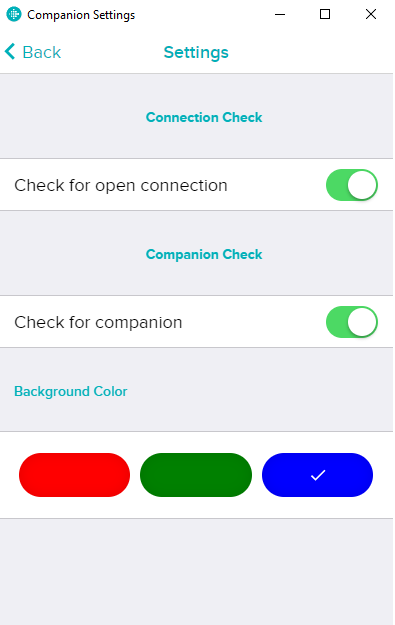

# windowssettings

[GAM](https://gallery.fitbit.com/details/3da28bd7-60bd-4050-a9f6-456702934fa0)

Problem: Companion doesn't properly install when using the [fitbit windows app](https://www.microsoft.com/en-us/p/fitbit/9wzdncrfj1xx?activetab=pivot:overviewtab)

Connection and companion switches are permanently true if the companion is running. If they can be toggled then companion is not running.
